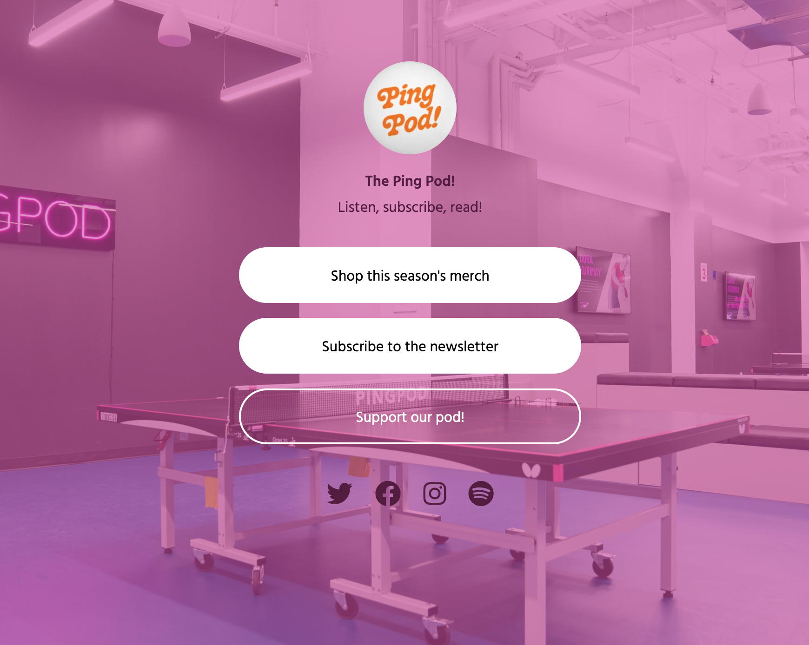

# Linktree

Connect audiences to all of your content with just one link

## Screenshots



## Run Locally

Clone the project

```bash
  git clone https://github.com/Almsrr/linktree.git
```

Go to the project directory

```bash
  cd linktree
```

Install dependencies

```bash
  yarn install
```

Start the server

```bash
  yarn run dev
```
